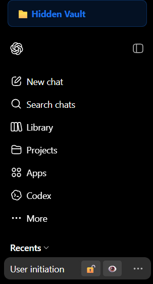
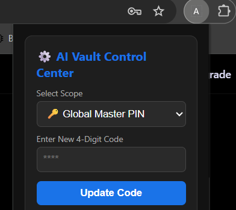
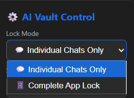
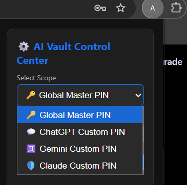

# 🛡️ AI Vault

Secure your AI chats. A privacy-first Chrome extension that provides local, encrypted locks and hidden folders for your ChatGPT, Gemini, and Claude conversations.

With AI becoming our daily journal, research assistant, and coding partner, keeping those conversations private is critical. AI Vault lets you lock or completely hide specific chats, storing all security keys locally on your machine using SHA-256 cryptography.

---

## ✨ Features

* **Cross-Platform Support:** Works seamlessly across ChatGPT, Google Gemini, and Claude.
* **Dual Security Modes:** Choose between granular **Individual Chat Locks** (securing specific conversations) or a **Complete App Lock** (gatekeeping the entire application).
* **Smart Adaptive UI Overlay:** The in-page PIN pad dynamically detects and states whether it requires your Global Master PIN or a platform-specific custom key.
* **Stealth Mode:** Completely hide sensitive chats from your sidebar into a smooth, collapsible, WhatsApp-style Hidden Vault container.
* **User-Away Auto-Lock:** A background idle engine that tracks activity. Configurable timeouts automatically clear active sessions, collapse the vault, and fire defensive blur filters when you walk away.
* **Anti-Tamper Privilege Protection:** Modifying any active PIN or provisioning custom keys requires passing a validation check of the current key to prevent unauthorized physical overrides.
* **Zero-Knowledge Architecture:** 100% of your data stays in local browser sandbox storage. No external servers, no network tracking, and no analytics.

---

## 🚀 How to Install (Developer Mode)

Since this extension is completely open-source and respects your privacy, it is run locally on your system:

1. Download this repository as a `.zip` file and extract it to a dedicated directory on your computer.
2. Open Google Chrome and navigate to `chrome://extensions/` in your address bar.
3. Turn on **Developer mode** using the toggle switch in the top right corner.
4. Click the **Load unpacked** button in the top left corner.
5. Select the **`src` folder** located inside your extracted directory. *(Note: Do not select the outer master folder, you must select the `src` folder containing the `manifest.json` file!)*

---

## 🔑 Configuration & Security Control Center

Click the extension puzzle icon in your toolbar to open the control center pane:

1. **Establish Master Key:** Enter a 4-digit numeric passcode to provision your Global Master PIN. 
2. **Lock Mode Selection:** Choose whether you want to secure individual chats separately or lock down the entire web application behind a master gate.
3. **Platform-Specific Codes:** Use the *Select Scope* dropdown to configure unique keys for individual platforms (ChatGPT, Gemini, Claude).
4. **PIN Modifications:** To update an existing key, you must enter your current passcode into the *Current PIN* field to authorize the overwrite.
5. **Auto-Lock Interval:** Select your preferred idle timeout duration (1 to 30 minutes). Changes update instantly across all open tabs without requiring a page refresh.

---

## 📖 User Instructions: How It Works

Once configured, the extension seamlessly embeds security controls directly onto your favorite AI dashboards.

### The Two Lock Modes
* **Individual Chats Mode:** Hover over any chat in your sidebar to reveal the Lock and Hide icons. Click the lock to secure *only* that specific conversation. You can freely browse other public chats.
* **Complete App Lock Mode:** The entire AI website is locked behind a 25px blur filter the moment you open it or walk away. You must enter your PIN before interacting with the UI.

### Securing & Hiding Chats (Individual Mode)
* **To Lock:** Click the open lock icon next to a chat. It will instantly switch to a closed lock icon.
* **To Unlock:** Click a locked chat. The main chat screen will blur out smoothly and present the in-page PIN pad. Type your 4-digit code and press `Enter`.
* **To Hide (Stealth):** Click the eye icon next to any chat. The conversation will instantly slide out of view and disappear from your main sidebar.
* **Accessing the Vault:** Click the `📁 Hidden Vault` folder at the top of your sidebar. Enter your PIN to temporarily reveal your hidden chats. Click it again to instantly collapse and secure them.

### The Auto-Lock / Inactivity Engine
The system monitors local tab activity in real-time. If you step away from your desk, the exact millisecond your idle countdown timer hits zero:
* Active chat authentication states are flipped back to locked.
* Opened stealth folders are collapsed and hidden.
* The interface is locked completely behind the canvas blur filter.

---

## ⌨️ Keyboard Shortcuts

* `Alt + L` : Instantly lock the current active chat session.
* `Alt + H` : Toggle the visibility of your Hidden Vault folder.

---

## 📸 Screenshots

### Sidebar Integration
AI Vault integrates directly into the ChatGPT, Gemini, and Claude sidebars, allowing you to lock conversations, hide sensitive chats, and access the Hidden Vault folder without leaving the platform.

---

### Global Master PIN Configuration
Set a single Master PIN that protects conversations across all supported AI platforms. The PIN modification process requires verifying your old key to prevent privilege escalation.

---
### Two Lock modes 
* **Individual Chats Mode** 
* **Complete App Lock Mode**

### Platform-Specific Security Codes & Away Timers
For additional flexibility, configure separate PINs for specific platforms, choose your Lock Mode, and set live auto-lock timeouts ranging from 1 to 30 minutes.

