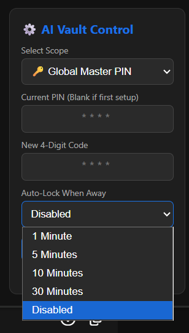

# 🛡️ AI Vault

Secure your AI chats. A privacy-first Chrome extension that provides local, encrypted locks and hidden folders for your ChatGPT, Gemini, and Claude conversations.

With AI becoming our daily journal, research assistant, and coding partner, keeping those conversations private is critical. AI Vault lets you lock or completely hide specific chats, storing all security keys locally on your machine using SHA-256 cryptography.

---

## ✨ Features

* **Cross-Platform Support:** Works seamlessly across ChatGPT, Google Gemini, and Claude using zero-overhead page abstraction adapters.
* **Smart Adaptive UI Overlay:** The in-page PIN pad dynamically detects and states whether it requires your Global Master PIN or a platform-specific custom key (e.g., *“Verify ChatGPT PIN”*).
* **Stealth Mode:** Completely hide sensitive chats from your sidebar into a smooth, collapsible, WhatsApp-style Hidden Vault container.
* **User-Away Auto-Lock:** A background idle engine that tracks mouse movements, clicks, scrolls, and keystrokes. Configurable timeouts (1, 5, 10, or 30 minutes) automatically clear active session state, collapse the vault folder, and fire the defensive blur filters when you walk away.
* **Anti-Tamper Privilege Protection:** Prevents unauthorized physical overrides. Modifying any active PIN or provisioning custom keys requires passing a validation check of the current key or Master admin key.
* **Zero-Knowledge Architecture:** 100% of your data stays in local browser sandbox storage. No external servers, no network tracking, and no analytics.
* **Cryptographic Security:** Passcodes are instantly digested into irreversible hex arrays using the hardware-accelerated Web Crypto API (SHA-256) before hitting your hard drive.

---

## 🚀 How to Install (Developer Mode)

Since this extension is completely open-source and respects your privacy, it is run locally on your system:

1. Download this repository as a `.zip` file and extract it to a dedicated directory on your computer.
2. Open Google Chrome and navigate to `chrome://extensions/` in your address bar.
3. Turn on **Developer mode** using the toggle switch in the top right corner.
4. Click the **Load unpacked** button in the top left corner.
5. Select the folder containing your extracted extension files (the one containing `manifest.json`).

---

## 🔑 Configuration & Security Control Center

Once the extension is installed, click the extension icon in your toolbar to open the control center pane to configure your operational thresholds:

1. **Establish Master Key:** Enter a 4-digit numeric passcode to provision your Global Master PIN. Click **Save Configurations**.
2. **Platform-Specific Codes:** Use the *Select Scope* dropdown to configure unique keys for individual platforms (ChatGPT, Gemini, Claude).
3. **PIN Modifications:** To update an existing key, you must enter your current passcode into the *Current PIN* field to authorize the write operation. If setting a platform custom code for the first time, verify your *Master PIN* to cross-authorize it.
4. **Auto-Lock Interval:** Select your preferred idle timeout duration from the dropdown. Changes write to the storage pipeline live and update open browser tabs instantly without requiring a page refresh.

---

## 📖 User Instructions: How It Works

Once configured, the extension seamlessly embeds security controls directly onto your favorite AI dashboards.

### Securing a Chat
Hover your mouse over any conversation item in your sidebar. Two icons will appear on hover: a **lock icon** and an **eye icon**.

### Using the Lock Feature
* **To Lock:** Click the open lock icon next to a chat. It will instantly switch to a closed lock icon, protecting that specific conversation runtime.
* **Accessing a Locked Chat:** If you click on a locked chat from your sidebar, or refresh the page while viewing one, the main chat screen will blur out smoothly via CSS filters and present the in-page PIN pad overlay.
* **To Unlock:** Type your 4-digit passcode into the overlay and press `Enter` or click `Submit`. The workspace will immediately clear up.
* **Sidebar Freedom:** You are never trapped by the full-screen blocker. If you do not want to unlock that specific chat, you can simply click on any other public chat in your sidebar to move away, and the PIN pad will safely dismiss itself.
* **Re-locking:** Clicking an already locked chat icon to revert it back to an unlocked state will challenge you for your PIN one more time to prevent unauthorized modifications.

### Using the Hide (Stealth) Feature
* **To Hide:** Click the eye icon next to any chat. The conversation will instantly slide out of view and completely disappear from your main sidebar loops.
* **Accessing the Vault Folder:** A clean folder item labeled `📁 Hidden Vault` sits anchored at the top of your sidebar.
* **Opening the Vault:** Click the folder. You will be prompted to verify your Master PIN. Once authenticated, your hidden chats will reveal themselves inside the sidebar with a distinct safety indicator border.
* **Closing the Vault:** Click the folder item again to instantly collapse and purge your stealth chats from plain sight.

### The Auto-Lock / Inactivity Engine
* The system monitors local tab activity in real-time. If you step away from your desk, the exact millisecond your idle countdown timer hits zero:
  * Active chat authentication states are flipped back to locked.
  * Opened stealth folders are collapsed and hidden.
  * Any open PIN pad structures are instantly purged from the DOM to force a complete layout re-evaluation, locking the interface completely behind a 25px canvas blur filter.

---

## ⌨️ Keyboard Shortcuts

* `Alt + L` : Instantly lock the current active chat session.
* `Alt + H` : Toggle the visibility of your Hidden Vault folder.

---

## 📸 Screenshots

### Sidebar Integration
AI Vault integrates directly into the ChatGPT, Gemini, and Claude sidebars, allowing you to lock conversations, hide sensitive chats, and access the Hidden Vault folder without leaving the platform.

---

### Global Master PIN Configuration
Set a single Master PIN that protects conversations across all supported AI platforms. The PIN modification process requires verifying your old key to prevent privilege escalation if you leave your desk.

---

### Platform-Specific Security Codes & Away Timers
For additional flexibility, configure separate PINs for specific platforms and set live auto-lock timeouts ranging from 1 to 30 minutes.

